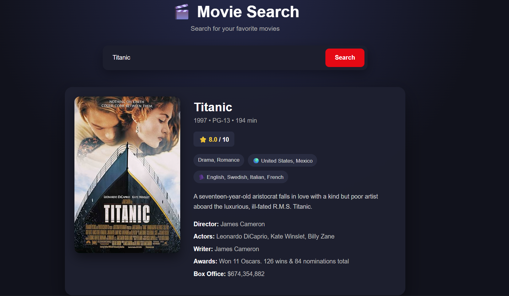

# 🎬 Movie Search App

A simple and responsive Movie Search web application built using **HTML, CSS, and JavaScript**.

The application allows users to search for movies and view detailed information using the OMDb API.

## 🚀 Features

* 🔍 Search movies by title
* 🖼️ Display movie posters
* ⭐ Show IMDb ratings
* 📅 Display release year
* 🎭 Show movie genre
* 🎬 Display director and actors
* 📝 Show movie plot
* 🏆 Display awards and other movie details
* ❌ Handle invalid movie searches
* ⏳ Loading state while fetching data
* 📱 Responsive design for mobile and desktop

## 🛠️ Technologies Used

* HTML5
* CSS3
* JavaScript
* Fetch API
* Async/Await
* OMDb API

## 📂 Project Structure

```text
Movie-Search-App/
│
├── index.html
├── style.css
├── script.js
├── Screenshot.png
└── README.md
```

## ⚙️ How to Run the Project

1. Clone or download this repository.
2. Get your own free OMDb API key.
3. Open `script.js`.
4. Replace:

```javascript
const API_KEY = "YOUR_API_KEY";
```

with your own API key.

5. Open `index.html` in your browser.
6. Enter a movie name and click **Search**.

## 🔑 API

This project uses the **OMDb API (Open Movie Database)** to fetch movie information.

You need your own API key to run the application.

**Note:** Never commit private or sensitive API keys to a public GitHub repository.

## 📚 What I Learned

While building this project, I practiced:

* Working with APIs using `fetch()`
* Using Promises and `async/await`
* Converting API responses using `response.json()`
* Handling errors with `try...catch`
* DOM manipulation
* Event handling
* Template literals
* Displaying dynamic data on a webpage
* Building responsive user interfaces

## 📸 Screenshot



## 👨‍💻 Author

**Shubham Kumar**

Built as part of my JavaScript learning journey.
